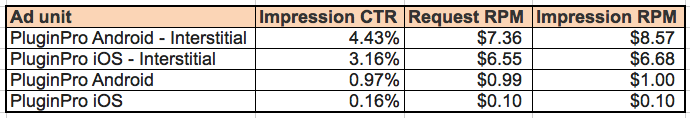

# GoogleAds PluginPro #

N-in-1 GoogleAds Plugin. Maximize revenue with mediation to AdMob, DoubleClick, iAd, Flurry, Millennial Media, InMobi, Mobfox, and much more.

Highlights:
- [x] Easy-to-use: Can display Ad with single line of Js code.
- [x] Powerful: Support banner, interstitial, and video Ad.
- [x] Max revenue: Support mediation with up to 8 leading mobile Ad services.
- [x] Multi-size: Multiple banner size, also support custom size.
- [x] Flexible: Fixed and overlapped mode, put banner at any position with overlap mode.
- [x] Smart: Auto fit on orientation change.
- [x] Up to date: Latest SDK and Android Google play services.
- [x] Good support: Actively maintained, prompt response.

Tested with:
* [x] Cordova CLI, v3.0+ (do not use the buggy v3.4)
* [x] Intel XDK, r1095+
* [x] IBM Worklight, v6.2+

Mediation with:
* [x] AdMob
* [x] DFP (DoubleClick for Publisher)
* [x] Facebook Audience Network
* [x] Flurry
* [x] iAd
* [x] InMobi
* [x] Millennial Media
* [x] MobFox

## How to use? ##

If use with Cordova CLI:
```bash
cordova plugin add com.google.cordova.admob
```

## Quick example with cordova CLI ##
```bash
	# create a demo project
    cordova create test1 com.rjfun.test1 Test1
    cd test1
    cordova platform add android
    cordova platform add ios

    # now add the plugin, cordova CLI will handle dependency automatically
    cordova plugin add com.google.cordova.admob

    # now remove the default www content, copy the demo html file to www
    rm -r www/*;
    cp plugins/com.google.cordova.admob/test/* www/;

	# now build and run the demo in your device or emulator
    cordova prepare; 
    cordova run android; 
    cordova run ios;
    # or import into Xcode / eclipse
```

Optional mediations to increase your revenue (Read about [AdMob Mediation Networks](https://developers.google.com/mobile-ads-sdk/docs/admob/android/mediation-networks)):
```bash
cordova plugin add com.google.cordova.admob-facebook
cordova plugin add com.google.cordova.admob-flurry
cordova plugin add com.google.cordova.admob-iad
cordova plugin add com.google.cordova.admob-inmobi
cordova plugin add com.google.cordova.admob-mmedia
cordova plugin add com.google.cordova.admob-mobfox
```

Notice: If you want to add multiple mediations, please balance flexibility and binary size.

If use with Intel XDK:
Project -> CORDOVA 3.X HYBRID MOBILE APP SETTINGS -> PLUGINS AND PERMISSIONS -> Third-Party Plugins ->
Add a Third-Party Plugin -> Get Plugin from the Web, input:
```
Name: AdMobPluginPro
Plugin ID: com.google.cordova.admob
[x] Plugin is located in the Apache Cordova Plugins Registry
```

If use with IBM Worklight:
As Worklight does not support importing Cordova Plugin directly, please read the [instruction in wiki](https://github.com/floatinghotpot/cordova-admob-pro/wiki/04.-How-to-Use-with-IBM-Worklight)

## Quick Start Example Code ##

Step 1: Prepare your AdMob Ad Unit Id for your banner and interstitial

```javascript
var ad_units = {
	ios : {
		banner: 'ca-app-pub-xxx/xxx', // or DFP format "/6253334/dfp_example_ad"
		interstitial: 'ca-app-pub-xxx/yyy'
	},
	android : {
		banner: 'ca-app-pub-xxx/zzz', // or DFP format "/6253334/dfp_example_ad"
		interstitial: 'ca-app-pub-xxx/kkk'
	}
};
// select the right Ad Id according to platform
var admobid = ( /(android)/i.test(navigator.userAgent) ) ? ad_units.android : ad_units.ios;
```

Step 2: Create a banner with single line of javascript

```javascript
// it will display smart banner at top center, using the default options
if(AdMob) AdMob.createBanner( admobid.banner );
```

Or, show the banner Ad in some other way:

```javascript
// or, show a banner at bottom
if(AdMob) AdMob.createBanner( {
	adId:admobid.banner, 
	position:AdMob.AD_POSITION.BOTTOM_CENTER, 
	autoShow:true} );

// or, show a rect ad at bottom in overlap mode
if(AdMob) AdMob.createBanner( {
	adId:admobid.banner, 
	adSize:'MEDIUM_RECTANGLE', 
	overlap:true, 
	position:AdMob.AD_POSITION.BOTTOM_CENTER, 
	autoShow:true} );

// or, show any size at any position
if(AdMob) AdMob.createBanner( {
	adId:admobid.banner, 
	adSize:'CUSTOM',  width:200, height:200, 
	overlap:true, 
	position:AdMob.AD_POSITION.POS_XY, x:100, y:200, 
	autoShow:true} );

```

Step 3: Prepare an interstitial, and show it when needed

```javascript
// preppare and load ad resource in background, e.g. at begining of game level
if(AdMob) AdMob.prepareInterstitial( {adId:admobid.interstitial, autoShow:false} );

// show the interstitial later, e.g. at end of game level
if(AdMob) AdMob.showInterstitial();
```

## Javascript API Overview ##

Methods:
```javascript
// set default value for other methods
setOptions(options, success, fail);
// for banner
createBanner(adId/options, success, fail);
removeBanner();
showBanner(position);
showBannerAtXY(x, y);
hideBanner();
// for interstitial
prepareInterstitial(adId/options, success, fail);
showInterstitial();
```

## Detailed Documentation ##

The APIs, Events and Options are detailed documented.

Read the detailed API Reference Documentation [English](https://github.com/floatinghotpot/cordova-admob-pro/tree/master/docs) / [中文说明](https://github.com/floatinghotpot/cordova-admob-pro/blob/master/docs/README.zh_cn.md).

## FAQ ##

If encounter problem when using the plugin, please read the [FAQ](https://github.com/floatinghotpot/cordova-admob-pro/wiki/FAQ) first.

## Full Example Code ##

This GoogleAds PluginPro offers the most flexibility and many options.

Check the [test/index.html] (https://github.com/floatinghotpot/cordova-admob-pro/blob/master/test/index.html).

## Screenshots ##

iPhone Banner | iPhone Medium Rect
-------|---------------
 | 
iPad Medium Rect | iPad SkyScraper
 | 
iPad interstitial | Any given X,Y:
 | 
Android Banner | Android Medium Rect
 | 
Android Interstitial | 
 |

## Tips ##

Some tips from recent stat data. (Fill rate and RPM may vary in different countries. For your reference only.)

- [x] Using AdMob Plugin Pro, higher and more stable fill rate. 


- [x] Using Interstitial, much better profit. 


- [x] Using SMART_BANNER, avoid using BANNER or FULL_BANNER

Smart banner will auto detect the screen, and auto set a proper height, to fit whenever it's phone or pad.

If use FULL_BANNER, when app running on phone with smalll screen, as the screen is not big enough, it will not show banner with error "No fill".

Glossary:
- Fill rate: The number of times ads are shown on your app, divided by the number of times your app requests to show an ad.
- eCPM / RPM: Revenue per 1000 impressions (RPM). RPM represents the estimated earnings you'd accrue for every 1000 impressions you receive.
- Intel XDK: Intel's HTML5 App IDE and service, to build mobile app in clould, allow using 3rd-party plugin from web.
- Adobe PhoneGap Build: Adobe service, to publish plugin and build app in cloud, only allow using plugins reviewed and approved.

## See Also ##

Ad PluginPro series for the world leading Mobile Ad services:

* [GoogleAds PluginPro](https://github.com/floatinghotpot/cordova-admob-pro), for Google AdMob/DoubleClick.
* [iAd PluginPro](https://github.com/floatinghotpot/cordova-iad-pro), for Apple iAd. 
* [FacebookAds PluginPro](https://github.com/floatinghotpot/cordova-plugin-facebookads), for Facebook Audience Network.
* [FlurryAds PluginPro](https://github.com/floatinghotpot/cordova-plugin-flurry), for Flurry Ads.
* [mMedia PluginPro](https://github.com/floatinghotpot/cordova-plugin-mmedia), for Millennial Meida.
* [MobFox PluginPro](https://github.com/floatinghotpot/cordova-mobfox-pro), for MobFox.
* [MoPub PluginPro](https://github.com/floatinghotpot/cordova-plugin-mopub), for MoPub.

More Cordova/PhoneGap plugins by Raymond Xie, [find them in plugin registry](http://plugins.cordova.io/#/search?search=rjfun).

If use in commercial project or need prompt support, please [buy a license](http://rjfun.github.io/), you will be supported with high priority.

Project outsourcing and consulting service is also available. Please [contact us](mailto:rjfun.mobile@gmail.com) if you have the business needs.

