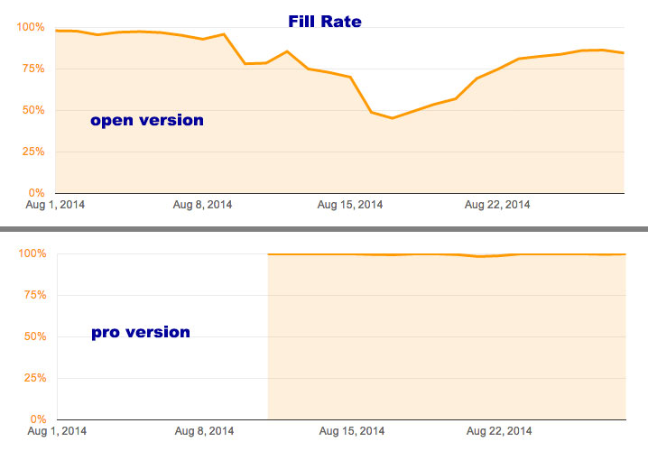

# AdMob Plugin Pro #

Present Google AdMob/DoubleClick Ads in Mobile App/Games natively with single line of JavaScript. 

Highlights:
- [x] Easy-to-use APIs. Can display Ad with single line of Js code.
- [x] Support banner and interstitial Ad.
- [x] Support AdMob and DoubleClick in one plugin.
- [x] Multiple banner size, also support custom size.
- [x] Fixed and overlapped mode.
- [x] Most flexible, put banner at any position with overlap mode.
- [x] Auto fit on orientation change.
- [x] Latest iOS SDK and Android Google play services.
- [x] Actively maintained, prompt support.

Tested with:

* Cordova CLI, v3.0+ (do not use the buggy v3.4)
* Intel XDK, r1095+
* IBM Worklight, v6.2+

## How to use? ##

If use with Cordova CLI:
```
cordova plugin add com.google.cordova.admob
```

If use with Intel XDK:
Project -> CORDOVA 3.X HYBRID MOBILE APP SETTINGS -> PLUGINS AND PERMISSIONS -> Third-Party Plugins ->
Add a Third-Party Plugin -> Get Plugin from the Web, input:
```
Name: AdMobPluginPro
Plugin ID: com.google.cordova.admob
[x] Plugin is located in the Apache Cordova Plugins Registry
```

If use with IBM Worklight:
As Worklight does not support importing Cordova Plugin directly, please read the [instruction in wiki](https://github.com/floatinghotpot/cordova-admob-pro/wiki/04.-How-to-Use-with-IBM-Worklight)

## Quick Start Example Code ##

Step 1: Prepare your AdMob Ad Unit Id for your banner and interstitial

```javascript
var ad_units = {
	ios : {
		banner: 'ca-app-pub-xxx/xxx', // or DFP format "/6253334/dfp_example_ad"
		interstitial: 'ca-app-pub-xxx/yyy'
	},
	android : {
		banner: 'ca-app-pub-xxx/zzz', // or DFP format "/6253334/dfp_example_ad"
		interstitial: 'ca-app-pub-xxx/kkk'
	}
};
// select the right Ad Id according to platform
var admobid = ( /(android)/i.test(navigator.userAgent) ) ? ad_units.android : ad_units.ios;
```

Step 2: Create a banner with single line of javascript

```javascript
// it will display smart banner at top center, using the default options
if(AdMob) AdMob.createBanner( admobid.banner );
```

Or, show the banner Ad in some other way:

```javascript
// or, show a banner at bottom
if(AdMob) AdMob.createBanner( {
	adId:admobid.banner, 
	position:AdMob.AD_POSITION.BOTTOM_CENTER, 
	autoShow:true} );

// or, show a rect ad at bottom in overlap mode
if(AdMob) AdMob.createBanner( {
	adId:admobid.banner, 
	adSize:'MEDIUM_RECTANGLE', 
	overlap:true, 
	position:AdMob.AD_POSITION.BOTTOM_CENTER, 
	autoShow:true} );

// or, show any size at any position
if(AdMob) AdMob.createBanner( {
	adId:admobid.banner, 
	adSize:'CUSTOM',  width:200, height:200, 
	overlap:true, 
	position:AdMob.AD_POSITION.POS_XY, x:100, y:200, 
	autoShow:true} );

```

Step 3: Prepare an interstitial, and show it when needed

```javascript
// preppare and load ad resource in background, e.g. at begining of game level
if(AdMob) AdMob.prepareInterstitial( {adId:admobid.interstitial, autoShow:false} );

// show the interstitial later, e.g. at end of game level
if(AdMob) AdMob.showInterstitial();
```

## Javascript API Overview ##

Methods:
```javascript
// set default value for other methods
setOptions(options, success, fail);
// for banner
createBanner(adId/options, success, fail);
removeBanner();
showBanner(position);
showBannerAtXY(x, y);
hideBanner();
// for interstitial
prepareInterstitial(adId/options, success, fail);
showInterstitial();
isInterstitialReady(callback);
```

## Detailed Documentation ##

The APIs, Events and Options are detailed documented.

Read the detailed API Reference Documentation [English](https://github.com/floatinghotpot/cordova-admob-pro/tree/master/doc) / [中文](https://github.com/floatinghotpot/cordova-admob-pro/blob/master/doc/README.zh_cn.md).

## FAQ ##

If encounter problem when using the plugin, please read the [FAQ](https://github.com/floatinghotpot/cordova-admob-pro/wiki/FAQ) first.

## Full Example Code ##

This AdMob Plugin Pro offers the most flexibility and many options.

Check the [test/index.html] (https://github.com/floatinghotpot/cordova-admob-pro/blob/master/test/index.html).

## Screenshots ##

iPhone Banner | iPhone Medium Rect
-------|---------------
 | 
iPad Medium Rect | iPad SkyScraper
 | 
iPad interstitial | Any given X,Y:
 | 
Android Banner | Android Medium Rect
 | 
Android Interstitial | 
 |

## Tips ##

Some tips from recent stat data. (Fill rate and RPM may vary in different countries. For your reference only.)

- [x] Using AdMob Plugin Pro, higher and more stable fill rate. 


- [x] Using Interstitial, much better profit. 


- [x] Using SMART_BANNER, avoid using BANNER or FULL_BANNER

Smart banner will auto detect the screen, and auto set a proper height, to fit whenever it's phone or pad.

If use FULL_BANNER, when app running on phone with smalll screen, as the screen is not big enough, it will not show banner with error "No fill".

Glossary:
- Fill rate: The number of times ads are shown on your app, divided by the number of times your app requests to show an ad.
- RPM: Revenue per 1000 impressions (RPM). RPM represents the estimated earnings you'd accrue for every 1000 impressions you receive.
- Intel XDK: Intel's HTML5 App IDE and service, to build mobile app in clould, allow using 3rd-party plugin from web.
- Adobe PhoneGap Build: Adobe service, to publish plugin and build app in cloud, only allow using plugins reviewed and approved.

## Credits ##

This AdMob Plugin Pro is published in a win-win partnership model:
- It's FREE. 
- It's closed source.
- 2% Ad traffic will be shared, as return for the support and maintenance effort.
- You will get commercial-level support with high priority, prompt and professional.

If you hope to make the Ad 100% under your control and keep 100% Ad revenue, you can also consider spending $15 to [get a license key](https://www.paypal.com/cgi-bin/webscr?cmd=_s-xclick&hosted_button_id=NRKTFZ88Q9KTW) to remove the 2% Ad traffic sharing.
It's much cheaper than [the $50.00 AdMob plugin for unity](https://prime31.com/plugins). 

Then set the license key in options (either API setOptions, or createBanner, or prepareInterstitial):
```javascript
    license: 'username@gmail.com/xxxxxxxxxxxxxxx',
```

AdMob Plugin Pro is your best choice for HTML5/Cordova/PhoneGap/XDK/Construct2 app/games.

- Recommended by Telerik in Verified Plugins Marketplace. [read more ...](http://plugins.telerik.com/plugin/admob)
- Recommended by William SerGio in code project (20 Jun 2014), [read more ...](http://www.codeproject.com/Articles/788304/AdMob-Plugin-for-Latest-Version-of-PhoneGap-Cordov)
- Recommended by Arne in Scirra Game Dev Forum (07 Aug, 2014), [read more ...](https://www.scirra.com/forum/plugin-admob-ads-for-crosswalk_t111940)
- Recommended by Intel XDK / Crosswalk (08/22/2014), [read more ...](https://software.intel.com/en-us/html5/articles/adding-google-play-services-to-your-cordova-application)
- Recommended by Scirra Construct 2 (09/12/2014) official release, [read more ...](https://www.scirra.com/construct2/releases/r180)

## See Also ##

Cordova/PhoneGap plugins for the world leading Mobile Ad services:

* [AdMob Plugin Pro](https://github.com/floatinghotpot/cordova-admob-pro), enhanced Google AdMob plugin, easy API and more features.
* [mMedia Plugin Pro](https://github.com/floatinghotpot/cordova-plugin-mmedia), enhanced mMedia plugin, support impressive video Ad.
* [iAd Plugin](https://github.com/floatinghotpot/cordova-plugin-iad), Apple iAd service. 
* [FlurryAds Plugin](https://github.com/floatinghotpot/cordova-plugin-flurry), Yahoo Flurry Ads service.
* [MoPub Plugin Pro](https://github.com/floatinghotpot/cordova-plugin-mopub), MobPub Ads service.
* [MobFox Plugin Pro](https://github.com/floatinghotpot/cordova-mobfox-pro), enhanced MobFox plugin, support video Ad and many other Ad network with server-side integration.

More Cordova/PhoneGap plugins by Raymond Xie, [click here](http://floatinghotpot.github.io/).

Project outsourcing and consulting service is also available. Please [contact us](http://floatinghotpot.github.io) if you have the business needs.

