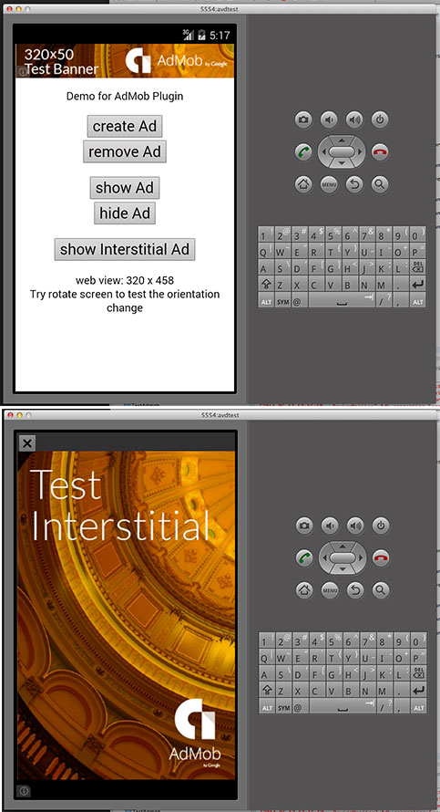
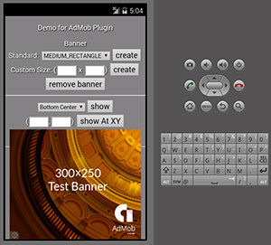
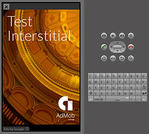

# AdMob Plugin Pro #

Present AdMob Ads in Mobile App/Games natively from JavaScript. 

Highlights:
- [x] Support Banner Ad and Interstitial Ad.
- [x] Most flexible, put banner at any position.
- [x] Multiple banner size, also support custom size.
- [x] Latest iOS SDK v6.11.1, 
- [x] Latest Android Google play services v19.
- [x] Easy-to-use APIs. Can display Ad with single line of Js code.
- [x] Actively maintained, prompt support.

More Cordova/PhoneGap plugins by Raymond Xie, [click here](http://floatinghotpot.github.io/).

## How to use? ##
```
cordova plugin add com.google.cordova.admob
```

## Quick Start Example Code ##

Step 1: Prepare your AdMob Ad Unit Id for your banner and interstitial

```javascript
var ad_units = {
	ios : {
		banner: 'ca-app-pub-6869992474017983/4806197152',
		interstitial: 'ca-app-pub-6869992474017983/7563979554'
	},
	android : {
		banner: 'ca-app-pub-6869992474017983/9375997553',
		interstitial: 'ca-app-pub-6869992474017983/1657046752'
	}
};
// select the right Ad Id according to platform
var admobid = ( /(android)/i.test(navigator.userAgent) ) ? ad_units.android : ad_units.ios;
```

Step 2: Create a banner with single line of javascript

```javascript
// it will display smart banner at top center, using the default options
if(AdMob) AdMob.createBanner( admobid.banner );
```

Step 3: Prepare an interstitial, and show it when needed

```javascript
// preppare and load ad resource in background, e.g. at begining of game level
if(AdMob) AdMob.prepareInterstitial( {adId:admobid.interstitial, autoShow:false} );

// show the interstitial later, e.g. at end of game level
if(AdMob) AdMob.showInterstitial();
```

## Javascript API Overview ##

Methods:
```javascript
// set default value for other methods
setOptions(options, success, fail);
// for banner
createBanner(adId/options, success, fail);
removeBanner();
showBanner(position);
showBannerAtXY(x, y);
hideBanner();
// for interstitial
prepareInterstitial(adId/options, success, fail);
showInterstitial();
isInterstitialReady(callback);
```
## Detailed Documentation ##
Read the detailed [API Reference Documentation](https://github.com/floatinghotpot/cordova-admob-pro/tree/master/doc).

## Full Example Code ##
Check the [test/index.html] (https://github.com/floatinghotpot/cordova-admob-pro/blob/master/test/index.html).

## Screenshots ##

iPhone Banner | iPhone Medium Rect
-------|---------------
 | 
iPad Medium Rect | iPad SkyScraper
 | 
iPad interstitial | Any given X,Y:
 | 
Android Banner | Android Medium Rect
 | 
Android Interstitial | 
 |

## Credit ##
You can use this cordova plugin for free. To support this project, donation is welcome.  

Donation can be accepted in either of following ways:
* Share 2% Ad traffic. 
* [Donate directly via Paypal or Payoneer](http://floatinghotpot.github.io/#donate)

