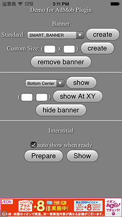
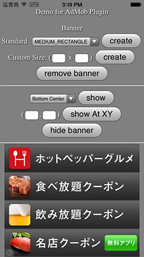
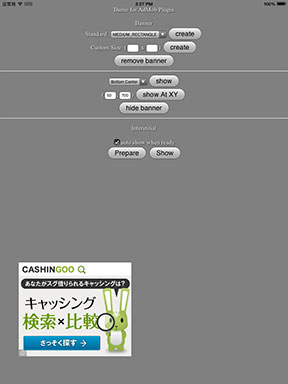

# AdMob Plugin Pro #

Present AdMob Ads in Mobile App/Games natively from JavaScript. 

Highlights:
* Support Banner Ad and Interstitial Ad.
* Most flexible, put banner at any position.
* Multiple banner size, also support custom size.
* Latest SDK, iOS SDK v6.10.0, Android Google play services v19
* Easy-to-use APIs. Can display Ad with single line of Js code.
* Actively maintained, prompt support.

Required:
* Cordova, >=3.0

## How to use? ##

    cordova plugin add com.google.cordova.admob

## Javascript API ##

APIs:
```javascript
setOptions(options, success, fail);

createBanner(adId/options, success, fail);
removeBanner();
showBanner(position, success, fail);
showBannerAtXY(x, y, success, fail);
hideBanner();

prepareInterstitial(adId/options, success, fail);
showInterstitialAd();
isInterstitialReady(callback);
```

Events: 
- onBannerReceive, onBannerFailedToReceive, onBannerPresent, onBannerDismiss, onBannerLeaveApp
- onInterstitialReceive, onInterstitialFailedToReceive, onInterstitialPresent, onInterstitialDismiss, onInterstitialLeaveApp

Ad Size (string):
- 'BANNER', 'SMART_BANNER', 'MEDIUM_RECTANGLE', 'FULL_BANNER', 'LEADERBOARD', 'SKYSCRAPER', 'CUSTOM'

Ad Position (integer): AdMob.AD_POSITION.*, * can be:
- POS_XY, TOP_LEFT, TOP_CENTER, TOP_RIGHT, LEFT, CENTER, RIGHT, BOTTOM_LEFT, BOTTOM_CENTER, BOTTOM_RIGHT

## Quick example with cordova CLI ##
```c
    cordova create <project_folder> com.<company_name>.<app_name> <AppName>
    cd <project_folder>
    cordova platform add android
    cordova platform add ios

    cordova plugin add com.google.cordova.admob

    // copy the demo html file to www
    rm -r www/*; cp plugins/com.google.cordova.admob/test/index.html www/

    cordova prepare; cordova run android; cordova run ios;
    
    // or import into Xcode / eclipse
```

## Example code ##

```javascript
// create your ad Id from admob for banner and interstitial
var ad_units = {
        ios : {
            banner: 'ca-app-pub-6869992474017983/4806197152',
            interstitial: 'ca-app-pub-6869992474017983/7563979554'
        },
        android : {
            banner: 'ca-app-pub-6869992474017983/9375997553',
            interstitial: 'ca-app-pub-6869992474017983/1657046752'
        }
    };
var admobid = ( /(android)/i.test(navigator.userAgent) ) ? ad_units.android : ad_units.ios;
```

Simple Use:
```javascript
	// it will display smart banner at top center, using the default options
	if(AdMob) AdMob.createBanner( admobid.banner );
```

Complex Use (if you need full control):
```javascript
function onDeviceReady() {
	if (! AdMob ) { alert( 'admob plugin not ready' ); return; }
	
    initAd(); 
    
    // this will display the banner at startup
    AdMob.createBanner( admobid.banner );
    
    // prepare interstitial 
    AdMob.prepareInterstitial( admobid.interstitial );
    
    // somewhere else, (not needed if autoShow:true)
    AdMob.showInterstitial();
}
function initAd(){
    var defaultOptions = {
            // publisherId: admobid.banner,
            // interstitialAdId: admobid.interstitial,
            // adSize: 'SMART_BANNER',
            // width: integer, // valid when set adSize 'CUSTOM'
            // height: integer, // valid when set adSize 'CUSTOM'
            // position: AdMob.AD_POSITION.BOTTOM_CENTER,
            // x: integer,		// valid when set position to 0 / POS_XY
            // y: integer,		// valid when set position to 0 / POS_XY
            // isTesting: false, // set to true, to receiving test ad for testing purpose
            // autoShow: true // auto show interstitial ad when loaded, set to false if prepare/show
            };
    AdMob.setOptions( defaultOptions );
    registerAdEvents();
}
// optional, in case respond to events or handle error
function registerAdEvents() {
    document.addEventListener('onBannerFailedToReceive', function(data){
    	alert('error: ' + data.error + ', reason: ' + data.reason);
    });
    document.addEventListener('onBannerReceive', function(){});
    document.addEventListener('onBannerPresent', function(){});
    document.addEventListener('onBannerLeaveApp', function(){});
    document.addEventListener('onBannerDismiss', function(){});
    
    document.addEventListener('onInterstitialFailedToReceive', function(data){
    	alert('error: ' + data.error + ', reason: ' + data.reason);
    });
    document.addEventListener('onInterstitialReceive', function(){});
    document.addEventListener('onInterstitialPresent', function(){});
    document.addEventListener('onInterstitialLeaveApp', function(){});
    document.addEventListener('onInterstitialDismiss', function(){});
}
```

See the working example code in [demo under test folder](test/index.html).

## Notice ##

* Ensure you have a proper AdMob account and create an Id for your app.
* You need create separate App for Android and iOS.
* You need create separate Ad Unit Id for Banner and interstitial.
* Call the plugin after 'deviceready' event.
 
## Screenshots (banner Ad / interstitial Ad) ##

iPhone, banner / medium rect:




iPad, medium rect / skyscrapter / interstitial / any position:




Android:


## Credit ##
You can use this cordova plugin for free. To support this project, donation is welcome.  
Donation can be accepted in either of following ways:
* Share 2% Ad traffic. 
* [Donate directly via Paypal](http://floatinghotpot.github.io/#donate)

