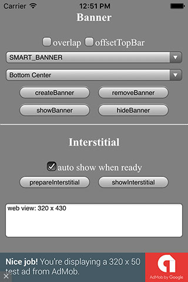
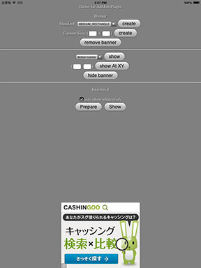
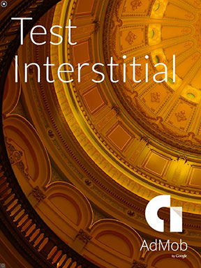
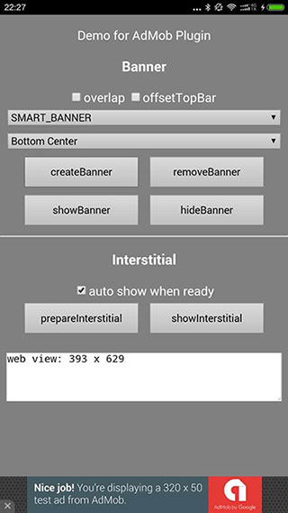
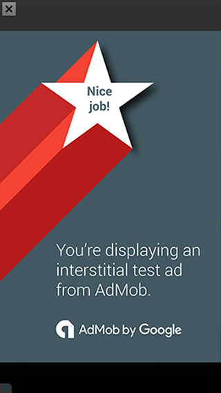

### Show Mobile Ad with 1 line of javascript code ###

Platforms supported:
- [x] Android
- [x] iOS
- [x] Windows Phone

Tested with:
* [x] Apache Cordova CLI, v3.0+ ([How To ...](https://github.com/floatinghotpot/cordova-admob-pro/wiki/01.-How-to-Use-with-Cordova-CLI))
* [x] Intel XDK, r1095+ ([How To ...](https://github.com/floatinghotpot/cordova-admob-pro/wiki/02.-How-to-Use-with-Intel-XDK))
* [x] IBM Worklight, v6.2+ ([How To ...](https://github.com/floatinghotpot/cordova-admob-pro/wiki/04.-How-to-Use-with-IBM-Worklight))
* [x] Google Mobile Chrome App ([How To ...](https://github.com/floatinghotpot/cordova-admob-pro/wiki/05.-How-to-Use-with-Mobile-Chrome-App))
* [ ] Adobe PhoneGap Build, NOT suported. (Reason: PhoneGap Build not accept binary files, even the jar or lib from official SDK)

Highlights:
- [x] Easy-to-use: Display Ad with single line of javascript code.
- [x] Powerful: Support banner, interstitial, and video Ad.
- [x] Max revenue: Support mediation with up to 8 leading mobile Ad services.
- [x] Multi-size: Multiple banner size, also support custom size.
- [x] Flexible: Fixed and overlapped mode, put banner at any position with overlap mode.
- [x] Smart: Auto fit on orientation change.
- [x] Same API: Exactly same API with other Ad plugins, easy to switch from one Ad service to another.
- [x] Up to date: Latest SDK and Android Google play services.
- [x] Good support: Actively maintained, prompt response.

Maximize your revenue with mediation adapters:
* [x] AdMob (built-in)
* [x] DFP (DoubleClick for Publisher, built-in)
* [x] Facebook Audience Network
* [x] Flurry
* [x] iAd
* [x] InMobi
* [x] Millennial Media
* [x] MobFox

## How to use? ##

If use with Cordova CLI:
```bash
cordova plugin add com.google.cordova.admob
```

## Quick start with cordova CLI ##
```bash
	# create a demo project
    cordova create test1 com.rjfun.test1 Test1
    cd test1
    cordova platform add android
    cordova platform add ios

    # now add the plugin, cordova CLI will handle dependency automatically
    cordova plugin add com.google.cordova.admob

    # now remove the default www content, copy the demo html file to www
    rm -r www/*;
    cp plugins/com.google.cordova.admob/test/* www/;

	# now build and run the demo in your device or emulator
    cordova prepare; 
    cordova run android; 
    cordova run ios;
    # or import into Xcode / eclipse
```

Optional mediations to increase your revenue (Read about [AdMob Mediation Networks](https://developers.google.com/mobile-ads-sdk/docs/admob/android/mediation-networks)):
```bash
cordova plugin add com.google.cordova.admob-facebook
cordova plugin add com.google.cordova.admob-flurry
cordova plugin add com.google.cordova.admob-iad
cordova plugin add com.google.cordova.admob-inmobi
cordova plugin add com.google.cordova.admob-mmedia
cordova plugin add com.google.cordova.admob-mobfox
```

Notice: If you want to add multiple mediations, please balance flexibility and binary size.

If use with Intel XDK:
Project -> CORDOVA 3.X HYBRID MOBILE APP SETTINGS -> PLUGINS AND PERMISSIONS -> Third-Party Plugins ->
Add a Third-Party Plugin -> Get Plugin from the Web, input:
```
Name: AdMobPluginPro
Plugin ID: com.google.cordova.admob
[x] Plugin is located in the Apache Cordova Plugins Registry
```

## Javascript API Overview ##

Methods:
```javascript
// use banner
createBanner(adId/options, success, fail);
removeBanner();
showBanner(position);
showBannerAtXY(x, y);
hideBanner();
// use interstitial
prepareInterstitial(adId/options, success, fail);
showInterstitial();
// set default value for other methods
setOptions(options, success, fail);
```

## Quick Start Example Code ##

Step 1: Prepare your AdMob Ad Unit Id for your banner and interstitial

```javascript
var ad_units = {
	ios : {
		banner: 'ca-app-pub-xxx/xxx', // or DFP format "/6253334/dfp_example_ad"
		interstitial: 'ca-app-pub-xxx/yyy'
	},
	android : {
		banner: 'ca-app-pub-xxx/zzz', // or DFP format "/6253334/dfp_example_ad"
		interstitial: 'ca-app-pub-xxx/kkk'
	}
};
// select the right Ad Id according to platform
var admobid = ( /(android)/i.test(navigator.userAgent) ) ? ad_units.android : ad_units.ios;
```

Step 2: Create a banner with single line of javascript

```javascript
// it will display smart banner at top center, using the default options
if(AdMob) AdMob.createBanner( admobid.banner );
```

Or, show the banner Ad in some other way:

```javascript
// or, show a banner at bottom
if(AdMob) AdMob.createBanner( {
	adId:admobid.banner, 
	position:AdMob.AD_POSITION.BOTTOM_CENTER, 
	autoShow:true} );

// or, show a rect ad at bottom in overlap mode
if(AdMob) AdMob.createBanner( {
	adId:admobid.banner, 
	adSize:'MEDIUM_RECTANGLE', 
	overlap:true, 
	position:AdMob.AD_POSITION.BOTTOM_CENTER, 
	autoShow:true} );

// or, show any size at any position
if(AdMob) AdMob.createBanner( {
	adId:admobid.banner, 
	adSize:'CUSTOM',  width:200, height:200, 
	overlap:true, 
	position:AdMob.AD_POSITION.POS_XY, x:100, y:200, 
	autoShow:true} );

```

Step 3: Prepare an interstitial, and show it when needed

```javascript
// preppare and load ad resource in background, e.g. at begining of game level
if(AdMob) AdMob.prepareInterstitial( {adId:admobid.interstitial, autoShow:false} );

// show the interstitial later, e.g. at end of game level
if(AdMob) AdMob.showInterstitial();
```

### Detailed Wiki ###

Quick start, simply copy & paste:
* [Example Code](https://github.com/floatinghotpot/cordova-admob-pro/wiki/1.0-Quick-Start-Example-Code)
* [Complete Demo index.html](https://github.com/floatinghotpot/cordova-admob-pro/blob/master/test/index.html)

API Reference:
* [API Overview](https://github.com/floatinghotpot/cordova-admob-pro/wiki/1.1-API-Overview)
* [How to Use Banner](https://github.com/floatinghotpot/cordova-admob-pro/wiki/1.3-Methods-for-Banner)
* [How to Use Interstitial](https://github.com/floatinghotpot/cordova-admob-pro/wiki/1.4-Methods-for-Interstitial)
* [How to Handle Ad Events](https://github.com/floatinghotpot/cordova-admob-pro/wiki/1.5-Events)
* [Chinese/中文文档](https://github.com/floatinghotpot/cordova-admob-pro/wiki/%E4%B8%AD%E6%96%87%E6%96%87%E6%A1%A3)

Other Documentations:
* [ChangeLog](https://github.com/floatinghotpot/cordova-admob-pro/wiki/ChangeLog)
* [FAQ](https://github.com/floatinghotpot/cordova-admob-pro/wiki/FAQ)
* [Notice for Android Proguard](https://github.com/floatinghotpot/cordova-admob-pro/wiki/Notice-for-Android-Proguard)

## Screenshots ##

iPhone Banner | iPhone Medium Rect
-------|---------------
 | 
iPad Medium Rect | iPad SkyScraper
 | 
iPad interstitial | Any given X,Y:
 | 
Android Banner | Android Medium Rect
 | 
Android Interstitial | 
 |

## Tips ##

Some tips from recent stat data, FYI.

- [x] Using AdMob Plugin Pro, higher and more stable fill rate. 
- [x] Using Interstitial, 5-10 times profit than banner Ad. 
- [x] Using SMART_BANNER, avoid using BANNER or FULL_BANNER.

## See Also ##

Ad PluginPro series for the world leading Mobile Ad services:

* [GoogleAds PluginPro](https://github.com/floatinghotpot/cordova-admob-pro), for Google AdMob/DoubleClick.
* [iAd PluginPro](https://github.com/floatinghotpot/cordova-iad-pro), for Apple iAd. 
* [FacebookAds PluginPro](https://github.com/floatinghotpot/cordova-plugin-facebookads), for Facebook Audience Network.
* [FlurryAds PluginPro](https://github.com/floatinghotpot/cordova-plugin-flurry), for Flurry Ads.
* [mMedia PluginPro](https://github.com/floatinghotpot/cordova-plugin-mmedia), for Millennial Meida.
* [MobFox PluginPro](https://github.com/floatinghotpot/cordova-mobfox-pro), for MobFox.
* [MoPub PluginPro](https://github.com/floatinghotpot/cordova-plugin-mopub), for MoPub.

More Cordova/PhoneGap plugins by Raymond Xie, [find them in plugin registry](http://plugins.cordova.io/#/search?search=rjfun).

If use in commercial project or need prompt support, please [buy a license](http://rjfun.github.io/), you will be supported with high priority.

Project outsourcing and consulting service is also available. Please [contact us](mailto:rjfun.mobile@gmail.com) if you have the business needs.

